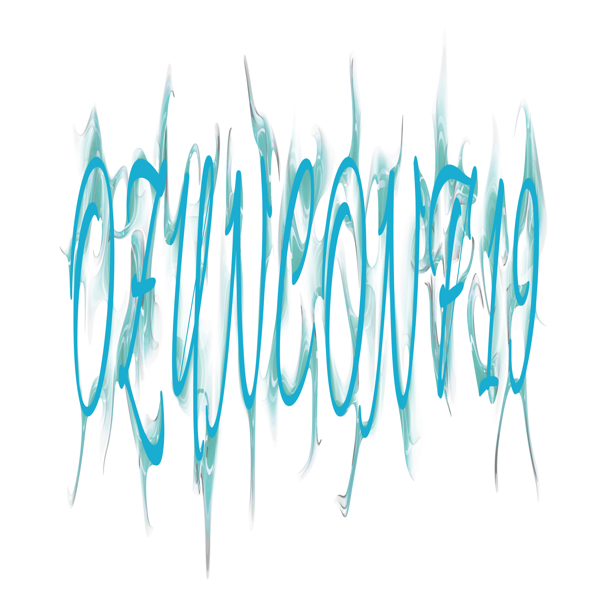

<!-- README.md is generated from README.Rmd. Please edit that file -->

```{r, include = FALSE}
knitr::opts_chunk$set(
  collapse = TRUE,
  comment = "#>"
)
```

# aRt_class


```{r heart1, message=FALSE, fig.width = 10, fig.height=10, dpi=300, cache=TRUE}
library(jasmines)
library(dplyr)
source(here::here("palettes.R"))

seed_heart(2000) %>%
  time_tempest(iterations = 100, curl_seed = 43, scale = .0075) %>%
  mutate(order = time) %>%
  style_ribbon(
  	palette = palette_whitened,
    alpha_decay = .03, 
  	alpha_init = 1, 
  	background = "white",
  	seed_fill = "#00000044"
  ) 
```


```{r delaunay, message = FALSE, fig.width = 10, fig.height=10, dpi=300, cache=TRUE}
source(here::here("seed_delaunay.R"))
set.seed(4)
dat <- seed_delaunay(n = 20, grain = 1000) %>%
	filter(id %in% sample(max(id), ceiling(max(id)*.4))) %>%
	mutate(x = x * 5, y = y * 5) %>%
  time_tempest(iterations = 100, curl_seed = 43, scale = .0075) %>%
  mutate(order = time) 

dat %>%
  style_ribbon(
  	palette = palette_whitened,
    alpha_decay = .03, 
  	alpha_init = 1, 
  	background = "white",
  	seed_fill = "#8BD3DA66", 
  	seed_col = "#ffffffaa",
  	seed_linewidth = 1,
  	size = 1
  )
```




Rainbow fish
```{r}
fish<-data.frame(
	x = cos(1:10000) - sin(1:10000)^2 / sqrt(2),
	y = cos(1:10000) * sin(1:10000)
)


fish$id<-1

fish[-10000,] %>%
	time_tempest(iterations = 10, curl_seed = 31) %>%
	dplyr::mutate(order = time) %>%
	style_ribbon(
		palette = rainbow,
		background = "black",
		seed_fill = "#8c8c8999"
	) 

```

