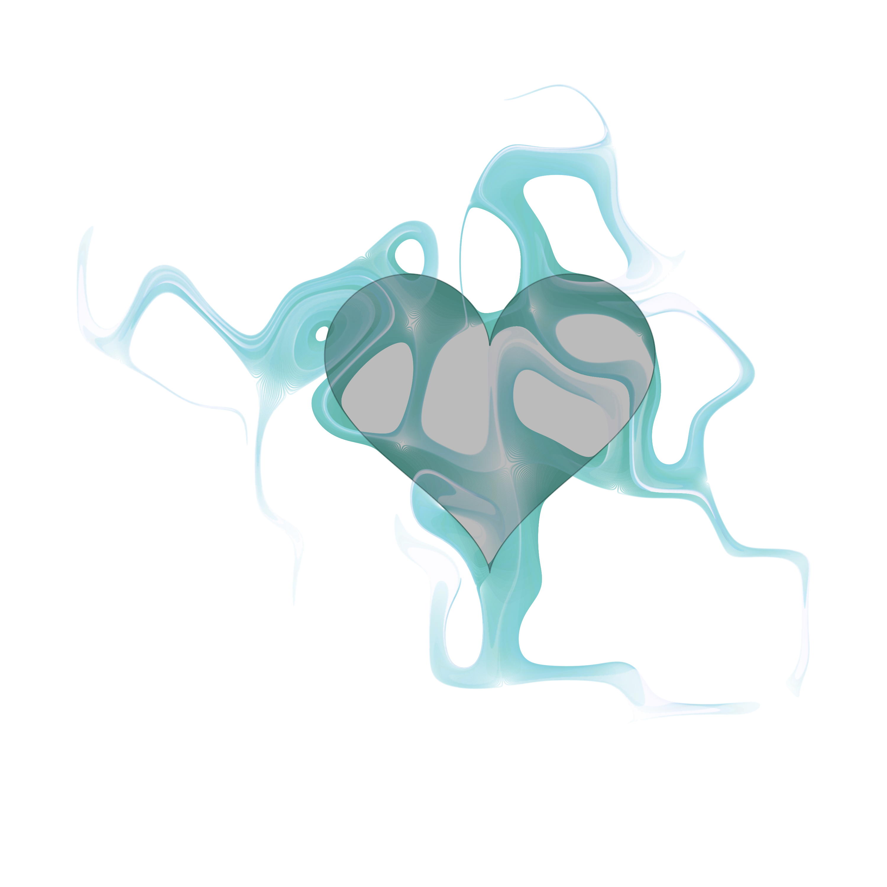

<!-- README.md is generated from README.Rmd. Please edit that file -->

# aRt\_class

``` r
library(jasmines)
library(dplyr)
source(here::here("palettes.R"))

seed_heart(2000) %>%
  time_tempest(iterations = 100, curl_seed = 43, scale = .0075) %>%
  mutate(order = time) %>%
  style_ribbon(
    palette = palette_whitened,
    alpha_decay = .03, 
    alpha_init = 1, 
    background = "white",
    seed_fill = "#00000044"
  ) 
```

<!-- -->

``` r
source(here::here("seed_delaunay.R"))
set.seed(4)
dat <- seed_delaunay(n = 20, grain = 1000) %>%
    filter(id %in% sample(max(id), ceiling(max(id)*.4))) %>%
    mutate(x = x * 5, y = y * 5) %>%
  time_tempest(iterations = 100, curl_seed = 43, scale = .0075) %>%
  mutate(order = time) 

dat %>%
  style_ribbon(
    palette = palette_whitened,
    alpha_decay = .03, 
    alpha_init = 1, 
    background = "white",
    seed_fill = "#8BD3DA66", 
    seed_col = "#ffffffaa",
    seed_linewidth = 1,
    size = 1
  )
```

<!-- -->
